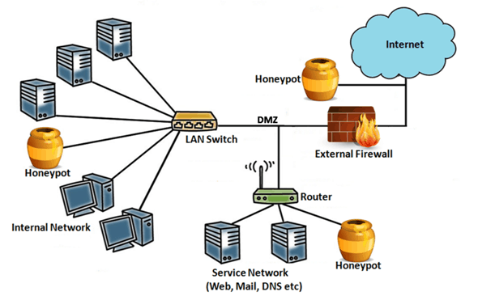

# Despliegue de MetaHoneypots IT en [organización]

<div style="text-align:center">
    
</div>

## Índice

1. [Resumen](#resumen)
2. [Qué es un Honeypot?](#queesunhoneypot)
3. [Categorías de Honeypots](#categoriasdehoneypots)
4. [MetaHoneypots y su Aplicación Práctica](#metahoneypotsysuaplicacionpractica)
5. [Implementación Ejecutiva](#implementacionejecutiva)
    - [Tendencias Actuales](#implementacionejecutivatendenciasactuales)
    - [Despliegue](#implementacionejecutivadespliegue)
    - [Listado de Honeypots](#implementacionejecutivalistadodehoneypots)
5. [Implementación Estratégica](#implementacionestrategica)
    - [Entorno](#implementacionestrategicaentorno)
    - [Honeypots de Producción - Simulados](#implementacionestrategicahoneypotsdeproduccionsimulados)
        - [QHoneypots](#implementacionestrategicahoneypotsdeproduccionsimuladosqhoneypots)
        - [T-PoT](#implementacionestrategicahoneypotsdeproduccionsimuladostpot)
    - [Honeypots de Producción - Real](#implementacionestrategicahoneypotsdeproduccionreal)
        - [Directorio Activo](#implementacionestrategicahoneypotsdeproduccionrealdirectorioactivo)
6. [Referencias](#referencias)


<div id='resumen'/>

## Resumen

El presente documento tiene como objetivo principal explorar y comprender el estado del arte en el ámbito de los honeypots, centrando la investigación en identificar las últimas tendencias y mejores prácticas relacionadas con su implementación y gestión eficaz.

Al analizar el estado actual de esta tecnología, se busca establecer una base sólida de conocimiento que oriente la definición de configuraciones específicas, aplicables a la organización. Además, se explorarán casos de uso prácticos y estudios que ilustren cómo las organizaciones han implementado con éxito honeypots en sus estrategias de defensa para mejorar la eficacia en la detección y la respuesta a amenazas cibernéticas.

En resumen, este documento busca proporcionar una guía integral sobre el estado del arte de los honeypots y, a su vez, servir como base para la formulación de estrategias de implementación y configuraciones personalizadas que fortalezcan la ciberseguridad de la organización de manera proactiva.


<div id='queesunhoneypot'/>

## Qué es un Honeypot?

Los honeypots son sistemas de seguridad que se diseñan para atraer, detectar y analizar amenazas cibernéticas en una red, los cuales han evolucionado como una estrategia de seguridad crucial. Estos sistemas actúan como señuelos, estratégicamente desplegados con el propósito de simular vulnerabilidades o recursos atractivos para posibles atacantes y programas maliciosos.

La función principal de un honeypot es recopilar información sobre tácticas de ataque, técnicas maliciosas y herramientas utilizadas por adversarios, donde las características clave son:

* **Simulación de Vulnerabilidades**: Los honeypots se configuran para parecer sistemas o servicios auténticos con vulnerabilidades aparentes, lo que atrae a los atacantes que buscan explotar tales debilidades.
* **Diversidad de Tipos**: Existen diferentes tipos de honeypots, como los de baja interacción que emulan servicios básicos, y los de alta interacción que simulan sistemas completos y permiten una interacción más profunda.
* **Captura de Datos y Actividad**: Los honeypots registran de manera exhaustiva la actividad de los atacantes, capturando datos como direcciones IP, métodos de ataque, herramientas utilizadas y patrones de comportamiento.
* **Detección Temprana**: Al estar diseñados para atraer a los atacantes en una etapa temprana del ciclo de ataque, los honeypots facilitan la detección antes de que se produzcan compromisos reales en los sistemas de producción.
* **Investigación y Análisis**: La información recopilada por los honeypots se convierte en fundamental para la investigación de amenazas y el análisis forense, ya que proporciona nuevas perspectivas sobre tácticas de ataque y patrones emergentes.
* **Desvío de Atacantes**: Al atraer a los atacantes hacia entornos controlados, los honeypots ayudan a desviar la atención y los esfuerzos maliciosos lejos de los sistemas críticos y recursos reales.
* **Fortalecimiento de la Seguridad**: El conocimiento adquirido a través de los honeypots permite fortalecer las medidas de seguridad, mejorando la resiliencia de la infraestructura.
* **Integración con Sistemas de Auxiliares**: Los datos recopilados por los honeypots pueden integrarse con sistemas de seguridad más amplios (SIEM, EDR, ...), mejorando la capacidad de respuesta y la coordinación en tiempo real frente a amenazas.

En síntesis, los honeypots son herramientas estratégicas que desempeñan un papel crucial en la ciberseguridad al proporcionar una visión única de las tácticas que llevan a cabo los atacantes y mejorar la capacidad de defensa de las organizaciones.


<div id='categoriasdehoneypots'/>

## Categorías de Honeypots

Existen diversas categorías o clasificaciones de honeypots, cada una diseñada con propósitos específicos y niveles de interacción variables:

* **Honeypots de Investigación**: Se centran en el estudio exhaustivo de tácticas y técnicas empleadas por atacantes y se caracterizan por su alta interactividad. Estos honeypots tienen la capacidad de recopilar datos detallados sobre los distintos métodos de ataque utilizados.
* **Honeypots de Producción (Alta Interacción)**: Se conciben con el objetivo de detectar y responder a amenazas en tiempo real y se integran directamente en la infraestructura operativa de una organización. Estos honeypots, caracterizados por su complejidad, poseen la capacidad de interactuar de manera profunda con los atacantes, incluyendo respuestas automáticas.
* **Honeypots de Baja Interacción**: Se diseñan con el propósito de simular servicios y sistemas operativos, limitando sus interacciones para minimizar los riesgos asociados de un ataque exitoso. Estos honeypots presentan características menos complejas y constituyen una opción menos invasiva en comparación con los de alta interacción, pudiendo identificar amenazas de manera segura y controlada.
* **Honeypots de Media Interacción**: Se corresponden con una combinación equilibrada entre la complejidad de los honeypots de alta interacción y la menor invasividad de los de baja interacción. Estos honeypots tienen como propósito simular servicios y sistemas operativos con un nivel intermedio de interacción.
* **Honeypots de Cliente**: Se diseñan para simular sistemas cliente como estaciones de trabajo y tienen como propósito atraer ataques dirigidos a este tipo de sistemas. Estos honeypots se caracterizan por su enfoque específico en los vectores de ataque contra clientes y aplicaciones, lo que permite analizar y comprender las amenazas dirigidas a este entorno particular.
* **Honeypots de Malware**: Se utilizan con el propósito de atraer y estudiar malware en un entorno controlado. Estos honeypots se caracterizan por simular vulnerabilidades o comportamientos específicos que atraen la atención de programas maliciosos.
* **Honeypots de Hardware**: Se implementan utilizando hardware dedicado y tienen como propósito simular sistemas reales. Estos honeypots se caracterizan por ser dispositivos físicos diseñados para atraer y analizar amenazas específicas.
* **Honeypots de SPAM**: Se diseñan para detectar y analizar ataques de correo no deseado. Estos honeypots se sitúan en entornos de red donde puedan atraer y registrar actividad maliciosa relacionada con el envío masivo de correos electrónicos.
* **Honeypots de Bases de Datos**: Se destinan a proteger y detectar amenazas dirigidas a sistemas de gestión de bases de datos. Estos honeypots registran de forma detallada las consultas maliciosas y los intentos de acceso no autorizado.
* **Honeypots de Investigación Académica**: Se emplean con fines educativos en entornos académicos para experimentación y aprendizaje. Estos honeypots se caracterizan por estar configurados de manera que permitan a los estudiantes profundizar en métodos de ataque y defensa.
* **Honeynets**: Se identifican con conjuntos de honeypots que simulan una red completa. Estos sistemas presentan características que ofrecen una visión más amplia de las estrategias de ataque y las herramientas utilizadas, brindando una perspectiva integral.

Para el escenario específico a tratar en este documento, se hace necesaria la implementación de varios tipos de honeypots, de acuerdo a la localización en la infraestructura y la información sobre amenazas que se desea recopilar.

La estrategia adecuada a seguir, es una combinación de honeypots más complejos que se integren en la infraestructura para detectar y responder a amenazas en tiempo real, y honeypots que simulen servicios más limitados para detectar otro tipo de amenazas de manera controlada. De esta forma se obtiene una cobertura completa y una visión amplia de las estrategias de ataque y herramientas utilizadas.


<div id='metahoneypotsysuaplicacionpractica'/>

## MetaHoneypots y su Aplicación Práctica

Los metahoneypots se distinguen por su capacidad para simular una variedad de sistemas y servicios, proporcionando una capa adicional de complejidad y realismo en la detección de amenazas. Estos sistemas van más allá de los honeypots convencionales al incorporar características avanzadas que amplían su utilidad y eficacia, siendo la evolución en este área. Entre las características adicionales que incluyen los metahoneypots están:

* **Versatilidad en Simulación**: Su versatilidad les permite simular no solo sistemas individuales, sino una variedad completa de entornos y servicios, ofreciendo una representación más completa y realista.
* **Adaptabilidad Dinámica**: Tienen la capacidad de adaptarse dinámicamente a las tácticas cambiantes de los atacantes, pudiendo ajustar su comportamiento y entorno para reflejar las últimas amenazas y tendencias en ciberseguridad.
* **Análisis de Amenazas Multifacético**: Además de la detección de amenazas, pueden realizar un análisis más profundo y multifacético de los comportamientos de los atacantes, identificando patrones y estrategias específicas utilizadas en diferentes fases del ataque.
* **Integración de Tecnologías Emergentes**: Al aprovechar tecnologías emergentes como el aprendizaje automático, mejoran la precisión en la identificación de amenazas.
* **Respuestas Automáticas y Orquestadas**: De acuerdo a su configuración, pueden ir más allá de la mera detección y desencadenar respuestas automáticas o acciones orquestadas, proporcionando una defensa más dinámica.
* **Capacidades de Engaño Avanzadas**: Estos honeypots avanzados son capaces de implementar tácticas de engaño más sofisticadas, confundiendo a los atacantes para que interactúen con entornos que parecen genuinos, pero que están cuidadosamente diseñados para recopilar información.
* **Escalabilidad y Distribución**: Pueden escalar eficientemente para abordar entornos complejos y distribuidos, adaptándose a las necesidades de organizaciones con infraestructuras extensas y diversas.
* **Integración con Plataformas de Seguridad**: La capacidad de integrarse sin problemas con otras plataformas de seguridad (SIEM, EDR, ...) permite una gestión centralizada y una colaboración mayor.

En su totalidad, estos honeypots se presentan como una herramienta avanzada y esencial para la detección proactiva y el análisis inteligente de amenazas cibernéticas en el contexto de entornos empresariales de creciente complejidad.


<div id='implementacionejecutiva'/>

## Implementación Ejecutiva


<div id='implementacionejecutivatendenciasactuales'/>

### Tendencias Actuales

En el panorama actual de la ciberseguridad, se observa una marcada evolución en la sofisticación de las amenazas cibernéticas. Los actores maliciosos emplean tácticas avanzadas para eludir las medidas tradicionales de seguridad y, esta realidad ha impulsado la necesidad de herramientas más avanzadas y adaptables para contrarrestar las amenazas emergentes.

En este contexto, los honeypots han experimentado una transformación significativa, evolucionando hacia metahoneypots capaces de ofrecer una respuesta eficaz y personalizada ante las tácticas en constante cambio.

Al simular entornos de red complejos y heterogéneos, estos honeypots avanzados no solo ofrecen una representación más realista, sino que también permiten la detección temprana y precisa de amenazas, pudiendo adaptarse dinámicamente a las tácticas cambiantes de los atacantes, lo que brinda una ventaja significativa y proporciona a las organizaciones una herramienta proactiva y estratégica para defenderse.


<div id='implementacionejecutivadespliegue'/>

### Despliegue

Los honeypots pueden actuar como un medio para someter a prueba las defensas existentes en un entorno dinámico. Al exponer deliberadamente señuelos atractivos, los honeypots identifican posibles lagunas que podrían pasar desapercibidas por otras capas de seguridad, mientras la información recopilada no solo valida la eficacia de las medidas de seguridad sino que también orienta la mejora continua al revelar áreas específicas que requieren atención y fortalecimiento.

La correcta implementación de metahoneypots, tanto en la infraestructura externa como interna de una organización, es un proceso complejo que involucra la **configuración, personalización y despliegue de una selección específica de honeypots** a fin de simular servicios reales y detectar amenazas cibernéticas de forma anticipada.

Para llevar a cabo una implementación efectiva, se deben tener en cuenta diversos factores, como la topología de la red, el tipo de activos que se desean exponer y los escenarios de amenazas específicos a desplegar. Además, un punto muy importante a resaltar es que la monitorización continua y la actualización de las firmas y perfiles de amenazas son esenciales para mantener la eficacia de los metahoneypots en constante evolución.


<div id='implementacionejecutivalistadodehoneypots'/>

### Listado de Honeypots

Entre los posibles honeypots a desplegar en la infraestructura de la organización, estarían los siguientes:

| Honeypot                                                             | Descripción (Resumen)                                                                                                                                                                                                                     | Servicios                                                                                                                                                     |
|----------------------------------------------------------------------|-------------------------------------------------------------------------------------------------------------------------------------------------------------------------------------------------------------------------------------------|---------------------------------------------------------------------------------------------------------------------------------------------------------------|
| [T-Pot](https://github.com/telekom-security/tpotce)                  | Plataforma de Honeypots todo en uno.                                                                                                                                                                                                      | All                                                                                                                                                           |
| [Cowrie](https://github.com/cowrie/cowrie)                           | Cowrie es un honeypot de interacción media a alta diseñado para registrar ataques de fuerza bruta y la interacción de la shell realizada por el atacante.                                                                                 | SSH, Telnet                                                                                                                                                   |
| [Conpot](https://github.com/mushorg/conpot)                          | Conpot es un honeypot para sistemas de control industrial (ICS)                                                                                                                                                                           | FTP, TFTP, HTTP, S7COMM, Modbus, ipmi, IEC104, Kamstrup meter, Guardian AST, Ethernet/IP, BACnet                                                              |
| [Gaspot](https://github.com/sjhilt/GasPot)                           | GasPot es un honeypot diseñado para simular un Veeder Root Guardian AST. Estos medidores de tanques son comunes en la industria del petróleo y gas para los tanques de estaciones de servicio y ayudan con el inventario de combustibles. | Guardian AST                                                                                                                                                  |
| [Qhoneypots](https://github.com/qeeqbox/honeypots)                   | 30 honeypots diferentes en un único paquete de PyPI para monitorear el tráfico de red, las actividades de bots y las credenciales de nombre de usuario y contraseña.                                                                      | DNS, Elastic, FTP, HTTP, HTPS, IMAP, IRC, LDAP, Memcached, MSSQL, MYSQL, NTP, ORACLE, POP3, PostgreSQL, Redis, SIP, SMB, SMTP, SNMP, SOCKS5, SSH, Telnet, VNC |
| [Glutton](https://github.com/mushorg/glutton)                        | Glutton proporciona un proxy SSH y TCP. El proxy SSH funciona como un intermediario entre el atacante y el servidor para registrar todo en texto plano.                                                                                   | SSH                                                                                                                                                           |
| [HellPot](https://github.com/yunginnanet/HellPot)                    | Hellpot es un honeypot basado en Heffalump que recopila información sobre bots HTTP.                                                                                                                                                      | HTTP                                                                                                                                                          |
| [Log4Pot](https://github.com/thomaspatzke/Log4Pot)                   | Un honeypot para la vulnerabilidad Log4Shell (CVE-2021-44228).                                                                                                                                                                            | HTTP, HTTPS                                                                                                                                                   |
| [medpot](https://github.com/schmalle/medpot)                         | Un honeypot que intenta emular HL7/FHIR.                                                                                                                                                                                                  | HL7/FHIR                                                                                                                                                      |
| [SentryPeer](https://github.com/SentryPeer/SentryPeer)               | Protege tus servidores SIP de actores maliciosos.                                                                                                                                                                                         | SIP                                                                                                                                                           |
| [ADBHoney](https://github.com/huuck/ADBHoney)                        | Honeypot de baja interacción diseñado para Android Debug Bridge sobre TCP/IP.                                                                                                                                                             | ADB                                                                                                                                                           |
| [Cisco ASA Honeypot](https://github.com/Cymmetria/ciscoasa_honeypot) | Honeypot de baja interacción para el componente Cisco ASA capaz de detectar CVE-2018-0101, una vulnerabilidad de denegación de servicio y ejecución remota de código.                                                                     | HTTP, HTTPS                                                                                                                                                   |
| [Citrix Honeypot](https://github.com/MalwareTech/CitrixHoneypot)     | Detecta y registra intentos de escaneo y explotación de CVE-2019-19781.                                                                                                                                                                   | HTTP, HTTPS                                                                                                                                                   |
| [DDoSPot](https://github.com/aelth/ddospot)                          | Plataforma de honeypot para el seguimiento y monitoreo de ataques de Denegación de Servicio Distribuido (DDoS) basados en UDP.                                                                                                            | DNS, NTP, SSDP, CHARGEN                                                                                                                                       |
| [ElasticPot](https://gitlab.com/bontchev/elasticpot)                 | Simula un servidor Elasticsearch vulnerable abierto a Internet.                                                                                                                                                                           | Elasticsearch                                                                                                                                                 |
| [Endlessh](https://github.com/skeeto/endlessh)                       | Endlessh es una trampa SSH que envía muy lentamente un banner SSH interminable y aleatorio para mantener a los clientes SSH bloqueados durante horas o incluso días.                                                                      | SSH                                                                                                                                                           |
| [Dicompot](https://github.com/nsmfoo/dicompot)                       | A Un honeypot DICOM (Digital Imaging and Communications in Medicine).                                                                                                                                                                     | DICOM                                                                                                                                                         |
| [Dionaea](https://github.com/DinoTools/dionaea)                      | Dionaea está destinado a ser un sucesor de Nepenthes, con soporte para IPv6 y TLS, y utiliza Python como lenguaje de scripting.                                                                                                           | Telnet, DNS, NTP, EPMAP, FTP, HTTP, Memcached, Mirror, MQTT, MSSQL, MYSQL, PPTP, SIP, SMB, TFTP, UPNP                                                         |
| [IPP Honey](https://gitlab.com/bontchev/ipphoney)                    | Simula una impresora que admite el Protocolo de Impresión por Internet y está expuesta a Internet.                                                                                                                                        | IPP                                                                                                                                                           |
| [mailoney](https://github.com/phin3has/mailoney)                     | Honeypot SMTP escrito con fines educativos y de aprendizaje.                                                                                                                                                                              | SMTP                                                                                                                                                          |
| [RedisHoneyPot](https://github.com/cypwnpwnsocute/RedisHoneyPot)     | Solución de honeypot de alta interacción para el protocolo Redis.                                                                                                                                                                         | Redis                                                                                                                                                         |
| [Heralding](https://github.com/johnnykv/heralding)                   | Un honeypot simple que recopila credenciales.                                                                                                                                                                                             | FTP, HTTP, HTTPS, IMAP, IMAPS, MYSQL, POP3, POP3S, PostgreSQL, RDP, SMTP, SMTPS, SOCKS5, SSH, Telnet, VNC                                                     |
| [Snare](https://github.com/mushorg/snare)                            | Snare es un sensor de honeypot de aplicación web que atrae todo tipo de comportamiento malicioso desde Internet.                                                                                                                          |                                                                                                                                                               |
| [Tanner](https://github.com/mushorg/tanner)                          | Tanner es un servicio remoto de análisis y clasificación de datos para evaluar solicitudes HTTP y componer la respuesta, luego servida por SNARE. Utiliza múltiples técnicas de emulación de vulnerabilidades de aplicaciones.            |                                                                                                                                                               |
| [Honeytrap](https://github.com/honeytrap/honeytrap)                  | Honeytrap es una herramienta de seguridad de red diseñada para observar ataques contra servicios TCP o UDP.                                                                                                                               | ADB, Counterstrike, CWmp tr-069, DNS, Echo, Elasticsearch, EOS, Ethereum, HTTP, HTTPS, IPP, LDAP, Memcached, Redis, SMTP, SSH, Telnet, TFTP, VNC              |


<div id='implementacionestrategica'/>

## Implementación Estratégica


<div id='implementacionestrategicaentorno'/>

### Entorno

Antes de proceder con el despliegue, es esencial realizar pruebas preliminares para determinar la cantidad adecuada de honeypots y su localización exacta, asegurando así un despliegue efectivo. En este contexto, es necesario que al menos la primera máquina de pruebas cuente con las siguientes especificaciones técnicas, a fin de asegurar un desempeño óptimo y coherente con los requerimientos de la tarea:

|                                     |                                              |
|-------------------------------------|----------------------------------------------|
| **Hardware**                        | Almacenamiento (128 GB), Memoria RAM (16 GB) |
| **Sistema Operativo**               | Debian                                       |
| **Copia de Seguridad / Frecuencia** | Si / Cada dos semanas                        |
| **Monitorización de Servicios**     | No                                           |
| **Vida Útil**                       | N/A                                          |
| **Comentarios**                     | Máquina de pruebas                           |


<div id='implementacionestrategicahoneypotsdeproduccionsimulados'/>

### Honeypots de Producción - Simulados


<div id='implementacionestrategicahoneypotsdeproduccionsimuladosqhoneypots'/>

#### QHoneypots

<div style="text-align:left">
    
</div>

```
sudo apt-get install postgresql
sudo apt-get install python-psycopg2
sudo apt-get install libpq-dev
pip3 install honeypots
```

```
curl https://raw.githubusercontent.com/qeeqbox/honeypots/main/tpot.txt > config.json
sudo -E python3 -m honeypots --setup http --config config.json
sudo -E python3 -m honeypots --setup ssh,mysql --options capture_commands --config config.json
```


<div id='implementacionestrategicahoneypotsdeproduccionsimuladostpot'/>

#### T-PoT

<div style="text-align:left">
    
</div>


```
git clone https://github.com/telekom-security/tpotce
cd tpotce/iso/installer/
sudo su -
./install.sh --type=user
```

```
https://localhost:64297
```


<div id='implementacionestrategicahoneypotsdeproduccionreal'/>

### Honeypots de Producción - Real


<div id='implementacionestrategicahoneypotsdeproduccionrealdirectorioactivo'/>

#### Directorio Activo

<div style="text-align:left">
    
</div>


<div id='referencias'/>

## Referencias

* [Github: Awesome Honeypots](https://github.com/paralax/awesome-honeypots)
* [Github: T-Pot - The All In One Honeypot Platform](https://github.com/telekom-security/tpotce)
* [Web Incibe: Industrial honeypot implementation guide](https://www.incibe-cert.es/sites/default/files/contenidos/guias/doc/incibe-cert_industrial_honeypot_implementation_guide.pdf)
* [Web UNAM: Conpot - Honeypot de Sistemas de Control Industrial](https://revista.seguridad.unam.mx/numero29/conpot-honeypot-de-sistemas-de-control-industrial)
* [Paper: SCADA Honeypots – An In-depth Analysis of Conpot](https://paper.vulsee.com/icsmaster/doc/%E5%9B%BD%E5%A4%96/SCADA%20Honeypots%20%E2%80%93%20An%20In-depth%20Analysis%20of%20Conpot.pdf)
* [Paper: HoneyPLC: A Next-Generation Honeypot for Industrial Control Systems](https://dl.acm.org/doi/pdf/10.1145/3372297.3423356)
* [Web LinkedIn: Honeypots Types, Technologies, Detection Techniques, and Tools](https://www.linkedin.com/pulse/honeypots-types-technologies-detection-techniques-tools-ahmed-eissa/)
* [Web LinkedIn: Honeypots o el arte del engaño (II)](https://es.linkedin.com/pulse/honeypots-o-el-arte-del-enga%C3%B1o-ii-roberto-ivars)
* [Web Hacking Articles: Comprehensive Guide on Honeypots](https://www.hackingarticles.in/comprehensive-guide-on-honeypots/)
* [Web Medium: Understanding Honeypots - A Powerful Tool for Improving Network Security](https://medium.com/@cyber_kid12/understanding-honeypots-a-powerful-tool-for-improving-network-security-45ea4a0ba6b1)
* [Web Medium: Creating and configuring a Honeypot account in Active Directory](https://pswalia2u.medium.com/creating-and-configuring-a-honeypot-account-in-active-directory-94153385275d)
* [Paper: Bitter Harvest- Systematically Fingerprinting Low and Medium interaction Honeypots at Internet Scale](https://www.cl.cam.ac.uk/~amv42/papers/vetterl-clayton-bitter-harvest-woot-18.pdf)
* [Paper: Gas what? - I can see your GasPots. Studying the fingerprintability of ICS honeypots in the wild](https://www.researchgate.net/publication/338128200_Gas_what_I_can_see_your_GasPots_Studying_the_fingerprintability_of_ICS_honeypots_in_the_wild#pf3)
* [Github: HASSH - Network fingerprinting standard](https://github.com/salesforce/hassh)
* [Paper: Approaches for Preventing Honeypot Detection and Compromise](https://michael.tsikerdekis.com/downloads/10.1109.GIIS.2018.8635603.pdf)
* [Web Medium: Customizing your Cowrie honeypot](https://cryptax.medium.com/customizing-your-cowrie-honeypot-8542c888ca49)
* [Github: Cowrie Honeypot Obscurer](https://github.com/411Hall/obscurer)
* [Web ShadowServer: Attack statistics](https://dashboard.shadowserver.org/statistics/honeypot/monitoring/vendor/?category=monitoring&statistic=unique_ips)
* [Web HoneyNet](https://www.honeynet.org/)
